# Table of Contents

1. [Step Project](#step-project---phonebook-web-application)
2. [Tech Stack](#tech-stack)
   <!-- 1. [User service](#user-service)
        1. [User model](#user-model)
        2. [Skill model](#skill-model)
        3. [UserSkill model](#userskill-model)
    2. [Timestamp service](#timestamp-service) -->
3. [Back-End](#back-end)
    1. [Api reference](#api-reference)
        1. [Get all users](#get-all-users)
        2. [Add user](#add-user)
        3. [Delete user](#delete-user)
        4. [Edit user](#edit-user)
        5. [Get specific user](#get-specific-user)
        6. [Get Status](#get-status)
    2. [Screenshoots](#screenshoots)
        1. [Get all users](#get-all-users-1)
        2. [Add user](#add-user-1)
        3. [Delete user](#delete-user-1)
        4. [Edit user](#edit-user-1)
        5. [Get specific user](#get-specific-user-1)
        6. [Get Status](#get-status)
4. [Front-End](#front-end)
    1. [Table](#table)
    2. [Create](#create)
    3. [Status](#status-1)

# Step Project - Phonebook web-application


It is the source code of my step project at ABB - Software Engineering 2 course.

The main goal of this project was to create Back-End which returns user list, delete and edit specific user, and also returns status of application and status of connection to database.


# Tech Stack
In this project I have used following technologies:

**Back-end:** C# - Asp.net

**Front-end:** React

**Database:** MySql

# Back-End

## API Reference

### Get all users

```bash
  GET /user/list
```
### Add user

```bash
  POST /user/add
```

| Parameter | Type     | Description                       |
| :-------- | :------- | :-------------------------------- |
| `name and phone`      | `string` | **Required** |

### Delete user

```bash
  DELETE /user/delete/{id}
```

| Parameter | Type     | Description                       |
| :-------- | :------- | :-------------------------------- |
| `Id`      | `Int` | **Required** |

### Edit user

```bash
  PATCH /user/edit/{id}
```

| Parameter | Type     | Description                       |
| :-------- | :------- | :-------------------------------- |
| `Id, name or phone`      | `Int, string` | **Id - Required** |

### Get specific user

```bash
  GET /user/{id}
```

| Parameter | Type     | Description                       |
| :-------- | :------- | :-------------------------------- |
| `Id`      | `Int` | **Required** |

### Get status

```bash
  GET /status
```
<hr>

## ScreenShoots

### Get All users
<p align="center">
  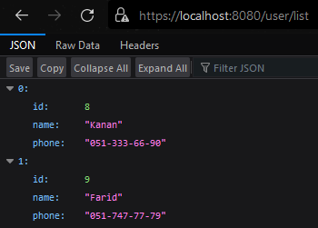
</p>

### Add user
<p align="center">
  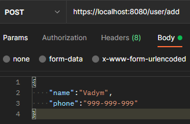
</p>

### Result-success
<p align="center">
  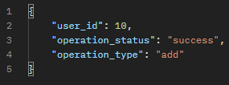
</p>

Now let's not add one field of the user
<p align="center">
  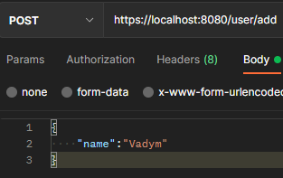
</p>

### Result-fail
<p align="center">
  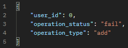
</p>

### Delete user
<p align="center">
  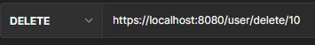
</p>

### Result-success
<p align="center">
  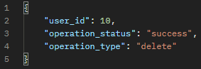
</p>

Now let's delete user that doesn't exist
<p align="center">
  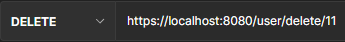
</p>

### Result-fail
<p align="center">
  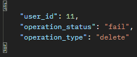
</p>

### Edit user
From this part I will use postman application
<p align="center">
  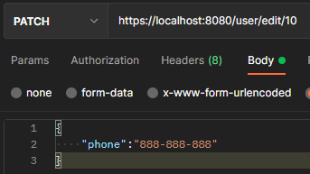
</p>

### Result-success
<p align="center">
  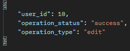
</p>

### Result-fail
<p align="center">
  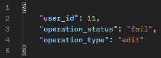
</p>

### Get Specific user
<p align="center">
  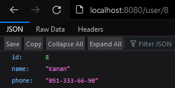
</p>
If we try to get user that doesn't exist we will get following result:

<p align="center">
  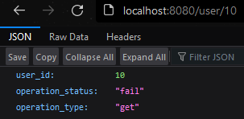
</p>


### Status
<p align="center">
  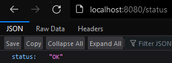
</p>

# Front-End

## Table

The table view of my application is following:

<p align="center">
  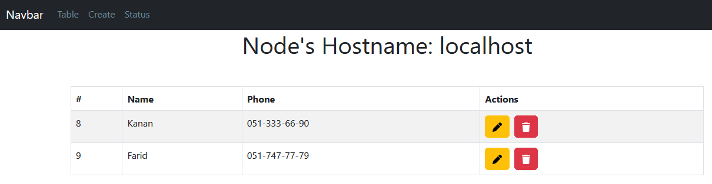
</p>

When I want to edit user I need to click Yellow pen icon, and for deleting clicking red button is enough

<p align="center">
  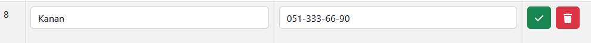
</p>

After editting and clicking green check icon we will get following result:

<p align="center">
  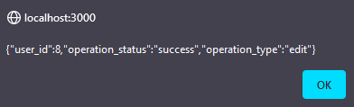
</p>

After deleting user we get following result

<p align="center">
  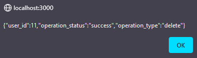
</p>

## Create
In order to create new user I need to fill the input forms

<p align="center">
  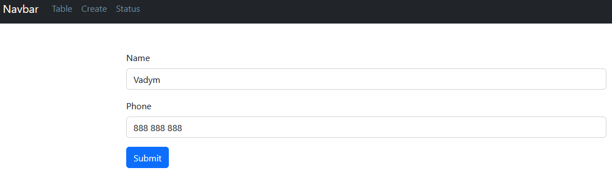
</p>

<p align="center">
  
</p>

## Status
The status page of my application is following:

<p align="center">
  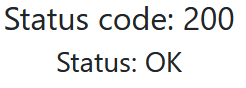
</p>


